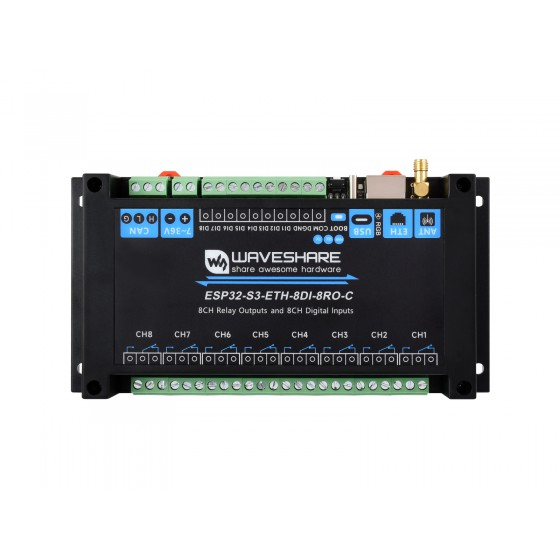

# ESP32-CZone Relay Firmware

Open-source ESP-IDF firmware that turns a **Waveshare `ESP32-S3-POE-ETH-8DI-8RO`**
board into an 8-channel relay module that speaks the **CZone® / NMEA 2000®**
network protocol. It is controlled from CZone displays/keypads and compatible MFDs, and exposes a USB serial terminal for local control
and diagnostics.

[](https://github.com/negrusti/esp32-czone/actions/workflows/ci.yml)

> ⚠️ **Unofficial project — please read the [Disclaimer](#disclaimer) before use.**

---

## Disclaimer

This is an **independent, unofficial, community/hobbyist project**. It is **not
affiliated with, authorized, endorsed, sponsored by, or supported by** Power
Products LLC, BEP Marine, the CZone brand, the NMEA, or any of their affiliates.

- **CZone®** and **BEP®** are trademarks of Power Products LLC / BEP Marine.
  **NMEA 2000®** is a trademark of the National Marine Electronics Association.
  These names are used here **only for identification and interoperability**
  (nominative use); no endorsement or ownership is implied.
- The protocol behaviour was derived by **reverse-engineering for
  interoperability**. To interoperate, this firmware presents NMEA 2000 / CZone
  identity fields (including a manufacturer code) so that existing CZone tooling
  will recognise it. **You are solely responsible** for how and where you deploy
  it, including any certification, licensing, or regulatory obligations.
- This firmware is **not a certified marine product**. It is **not suitable for
  safety-critical use**. Do **not** rely on it for navigation, propulsion,
  bilge, fire, or any other safety-related system.
- Provided **“as is”, without warranty of any kind**. Use entirely at your own
  risk. See [LICENSE](LICENSE).


---

## Hardware

Target board: **Waveshare ESP32-S3-POE-ETH-8DI-8RO** (ESP32-S3, 8 MB flash,
8 relay outputs, 8 isolated digital inputs, PoE Ethernet, CAN).




| Function        | Pin / address                                            |
| --------------- | -------------------------------------------------------- |
| Relay expander  | TCA9554 @ I²C `0x20`, outputs map to relay channels 1–8  |
| I²C bus         | SDA `GPIO42`, SCL `GPIO41`                                |
| CAN / TWAI      | TX `GPIO17`, RX `GPIO18`, 250 kbit/s (NMEA 2000)          |
| Digital inputs  | `GPIO4`–`GPIO11` (DIN 1–8)                                |
| RGB LED         | `GPIO38`                                                  |
| Buzzer          | `GPIO46`                                                  |
| Console         | native USB Serial/JTAG                                    |

The board is wired to an NMEA 2000 backbone for CAN; PoE/Ethernet is not used by
this firmware.

## What it does

- **NMEA 2000 node** — ISO address claim, product/configuration information,
  PGN list, heartbeat, and request handling.
- **CZone relay module** — responds to CZone circuit/switch commands and binary
  switch-bank control, drives the 8 relays, and broadcasts switch/circuit
  status.
- **ZCF configuration** — receives the network `.zcf` over the CZone block
  transfer (PGN 130816), validates its CRC, and stores it. It then **parses the
  config**, extracts the **circuit → relay-output map for this module’s
  dipswitch**, and uses it to switch the right relays (with circuit and load
  labels available locally). Config survives power loss and is re-applied at
  boot.
- **Config read-back & arbitration** — on a read request, holders elect a single
  sender (back-off by module address, defer to a lower-address / newer-version
  holder), mirroring the CZone tool’s behaviour, so the board cooperates instead
  of flooding the bus.
- **Runtime dipswitch** — the CZone module address is configurable at runtime and
  stored in NVS.
- **USB terminal** — local relay control and diagnostics.

## Install (flash a release)

Download the binaries for the latest version from the
[Releases page](https://github.com/negrusti/esp32-czone/releases).

Flashing uses Espressif's **esptool**, which requires **Python 3**:

```bash
pip install esptool
```

(Or `pipx install esptool`; or grab a standalone `esptool` binary from the
[esptool releases](https://github.com/espressif/esptool/releases) and drop the
`.py` from the commands below. On newer esptool the command is `esptool`; on
older it is `esptool.py` — both forms work in recent versions.)

**Full install** — blank chip or clean reflash. Writes bootloader + partition
table + application as one image at offset `0x0`:

```bash
esptool.py --chip esp32s3 write_flash 0x0 esp32-czone-v0.1.0-factory.bin
```

**Application-only update** — keep the stored config, NVS dipswitch and SPIFFS;
write just the app at `0x10000`:

```bash
esptool.py --chip esp32s3 write_flash 0x10000 esp32-czone-v0.1.0-app.bin
```

Notes:

- Replace `v0.1.0` with the version you downloaded.
- Add `--port COM7` (Windows) or `--port /dev/cu.usbmodemXXXX` (macOS/Linux) if
  esptool does not auto-detect the board. It uses the ESP32-S3 native
  USB-Serial/JTAG (`VID:PID 303A:1001`) and resets into the app automatically —
  no buttons needed. If it cannot connect, hold **BOOT**, tap **RESET**, release
  BOOT, then retry.
- After flashing, open the serial port at 115200 and type `help` to confirm.
- Verify downloads if you wish: `shasum -a 256 -c SHA256SUMS.txt` (macOS/Linux)
  or `certutil -hashfile <file> SHA256` (Windows).
- A browser flasher ([esptool-js](https://espressif.github.io/esptool-js/),
  Chrome/Edge) can flash `factory.bin` at `0x0` with no install — but afterwards
  click **Disconnect** (or close the tab) and replug the cable, otherwise the
  serial port stays locked.

## Build

Uses [PlatformIO](https://platformio.org/) with the native **ESP-IDF** framework
(no Arduino).

```bash
pio run                 # build
pio run -t uploadfs     # (optional) flash a .zcf placed in data/config.zcf
```

Flash & monitor:

```bash
./flash.cmd COM7
pio device monitor --port COM7
```

### Versioning

`VERSION` holds the semantic version (`MAJOR.MINOR.PATCH`).
`scripts/generate_version_header.py` runs before each build and writes
`include/czone_firmware_version.h`, which fills the NMEA 2000 software-version
field reported in Product Information.

### Releases

Pushing a tag like `v0.1.0` triggers the **Release** workflow, which builds and
publishes:

- `…-factory.bin` — full image for a blank chip, flash at `0x0`.
- `…-app.bin` — application only, flash at `0x10000` to update a provisioned board.

See [Install (flash a release)](#install-flash-a-release) for how to flash them.

## USB terminal

The firmware exposes a terminal on the ESP32-S3 native USB port (same port as the
log output). Type `help`:

```text
help                 Show help
reboot               Restart the device
status               Show relay states
on / off / toggle N  Control relay N (1–8)
mask 0xNN            Set all relays by bit mask
all on | all off     All relays
zcf                  Stored ZCF file + parsed-config status
czone map            Circuit ID -> relay output map (with circuit/load labels)
czone dipswitch [b]  Show, or set from 8-bit binary (e.g. 00011000), the module
                     address (saved to NVS)
canmonitor all|czone|zcf|off   CAN receive logging modes
```

Press `Esc` to disable CAN monitoring immediately.

## Getting a config onto the board

- **Over the NMEA2000** — upload from the CZone configuration tool; the board
  stores and applies it automatically.
- **Over USB** — place a `.zcf` at `data/config.zcf` and run `pio run -t uploadfs`
  (writes the SPIFFS `storage` partition).

## Repository layout

| Path | Purpose |
| --- | --- |
| `src/czone_protocol.c` | NMEA 2000 / CZone PGN decode, fast-packet TX/RX, ZCF transfer + arbitration |
| `src/zcf_config.c` | ZCF parser → circuit/relay map for this dipswitch |
| `src/device_config.c` | NVS-backed runtime settings (dipswitch) |
| `src/zcf_store.c` | SPIFFS storage of the received `.zcf` |
| `src/relay_controller.c` / `src/tca9554.c` | relay output driver |
| `src/digital_inputs.c` | digital input polling |
| `src/czone_can.c` | TWAI/CAN setup and RX/TX |
| `src/usb_terminal.c` | USB serial command terminal |
| `include/czone_device_identity.h` | NMEA 2000 / CZone identity (edit to customise) |

## License

Released under the **[GNU General Public License v3.0](LICENSE)** (GPLv3). You may
redistribute and/or modify it under those terms; it comes with **no warranty**.
Trademarks referenced above remain the property of their respective owners.
